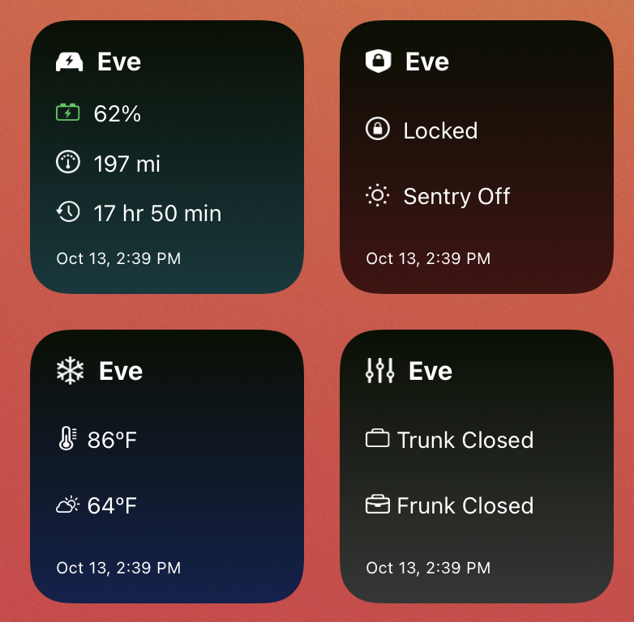

# Tesla Scriptable Widgets

A set of four scripts to use as widgets that provide at-a-glance information about your Tesla's battery, security, climate, and trunk/frunk.



## Setup and usage

These scripts use Tesla’s (unofficial) API to get information about your car. An access token is required for authentication when making these API requests.

You must install the [Auth app for Tesla](https://apps.apple.com/us/app/auth-app-for-tesla/id1552058613) iOS app to generate this token. This app handles authentication using your Tesla credentials and provides it to these shortcuts. Your credentials are not stored anywhere. This access token does expire and the app will handle updating it. However, you will need to update the access token in your widgets when this happens (usually 45 days).

### Getting an access token and car ID

The following shortcuts for the Shortcuts iOS app are used to generate an access token using your login credentials and to get the ID of your Tesla.

- [Scriptable Widgets for Tesla](https://www.icloud.com/shortcuts/fa7ae4aba4e145a8a23b2defef838c2d)
- [Tesla Car Select](https://www.icloud.com/shortcuts/49c91321c3374dbd9027730ea2442264)
- [Tesla Wake Car](https://www.icloud.com/shortcuts/7cf7713329f64a93a4f61ee93d06990c)

All these shortcuts must be installed but you only need to run the **Scriptable Widgets for Tesla** shortcut (the others are run within the shortcut). I created these shortcuts as part of my [Shortcuts for Tesla](https://jordanmerrick.com/shortcuts/shortcuts-for-tesla/) collection: a set of shortcuts to control and get information about your Tesla. If you have more than one Tesla associated with your account, the Tesla Car Select shortcut displays a list to select from.

### Setting up the scripts

The shortcut formats the token and car ID as variables and copies them to the clipboard. For example:

```
const accessToken = 'token123'
const carId = '123id'
```
Paste this into each script so it can retrieve information about your Tesla.

Each script gets specific information about your Tesla from Tesla's API and creates a widget for you to use on the Home screen. You can also add these scripts to Siri and display them when making a Siri request.

The scripts automatically retrieves the name of your car and the unit of measurement it uses for temperature and distance. Tesla's API returns celsius and miles units so the scripts automatically convert these for you.

## Tesla Battery Status

Displays the battery level and estimated range of your Tesla in either miles or kilometers. Also displays the estimated charge time if the car is currently charging.

## Tesla Climate Status

Displays the interior and exterior temperatures in either celsius or fahrenheit. Also displays the specified climate control temperature if the car is preconditioning.

## Tesla Security Status

Displays the locked or unlocked status of the doors and whether Sentry Mode is on or off.

## Tesla Trunk and Frunk Status

Displays the open or closed status of the trunk and frunk.

## Credits

My thanks to @timdorr for his [unofficial Tesla API documentation](https://tesla-api.timdorr.com/).
